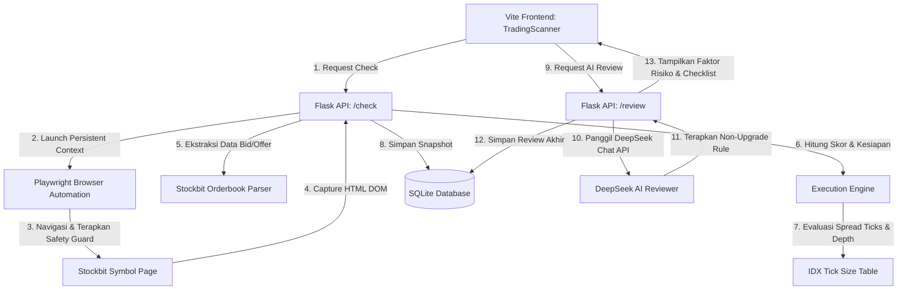

# Dokumentasi Fitur: Stockbit Order Book Execution Confirmation

Dokumentasi ini menjelaskan arsitektur, parameter penilaian, arsitektur keamanan, API endpoints, serta alur frontend dari fitur **Stockbit Order Book Execution Confirmation** (Tahap 1 hingga Tahap 5).

---

## 1. Arsitektur & Alur Data

Fitur ini bertindak sebagai lapisan verifikasi tambahan (*safe read-only*) sebelum user mengeksekusi order buy/sell dari hasil scanner kuantitatif:



---

## 2. Lapisan Keamanan (Safety Guardrails)

Untuk memastikan automasi berjalan secara **read-only** dan aman dari pemblokiran akun atau kebocoran data, sistem menerapkan guardrail ketat di `browser_safety_guard.py`:

1. **Domain Validation**: Hanya memperbolehkan navigasi ke URL dengan domain secure HTTPS `*.stockbit.com` (atau localhost untuk pengujian unit).
2. **Blocked Selectors**: Semua aksi selektor yang mengandung kata-kata bernuansa transaksi (misal: `buy`, `sell`, `order`, `submit`, `beli`, `jual`, `confirm`) diblokir secara mutlak di tingkat Python API.
3. **Credentials Interception Shield**: Pengisian (fill/type) ke kolom password, PIN, atau OTP diblokir secara otomatis dan akan melemparkan `SecurityViolation`.
4. **AI Non-Upgrade Constraint**: DeepSeek AI bertindak murni sebagai *risk reviewer*. Jika mesin penilai deterministik menyatakan status `AVOID_EXECUTION` (misal karena spread terlalu lebar atau snapshot kedaluwarsa), AI dilarang keras mengubah status menjadi `EXECUTION_OK`.

---

## 3. SQLite Database Schema

Data snapshot dan review disimpan ke dalam dua tabel baru di `money_management.db`:

### Tabel `orderbook_snapshots`
Menyimpan snapshot mentah order book hasil scraping:
* `id` (TEXT PRIMARY KEY): UUID snapshot.
* `ticker` (TEXT): Kode saham (misal: `TLKM`).
* `page_url` (TEXT): URL halaman Stockbit yang dibaca.
* `snapshot_json` (TEXT): Representasi JSON dari bid/offer rows, harga terakhir, dan confidence level.
* `execution_result_json` (TEXT): Hasil skoring instan dari engine deterministik.
* `read_at` (TEXT): Timestamp pembacaan dari halaman Stockbit.
* `created_at` (TEXT): Timestamp penyimpanan ke database.

### Tabel `orderbook_execution_reviews`
Menyimpan histori evaluasi penuh termasuk analisis risiko DeepSeek AI:
* `id` (TEXT PRIMARY KEY): UUID review.
* `ticker` (TEXT): Kode saham.
* `quant_candidate_json` (TEXT): Data kandidat quant dari scanner backend saat check dijalankan.
* `orderbook_snapshot_json` (TEXT): Data snapshot order book yang dianalisis.
* `execution_result_json` (TEXT): Hasil evaluasi engine deterministik.
* `deepseek_review_json` (TEXT): Analisis risiko, faktor pendukung/penghambat, dan manual checklist dari DeepSeek AI.
* `created_at` (TEXT): Timestamp pembuatan.

---

## 4. API Endpoints

### 1. `POST /api/execution/orderbook/check`
Menjalankan browser automation local secara headless/headful, membaca order book, melakukan evaluasi deterministik, dan menyimpan ke database.
* **Payload**:
  ```json
  {
    "ticker": "TLKM",
    "candidate_id": "uuid-kandidat-dari-scan-cache",
    "planned_order_lots": 10,
    "headless": true
  }
  ```
* **Response (Success)**:
  * Status: `200 OK`
  * Body: `{"status": "success", "snapshot_id": "...", "review_id": "...", "snapshot": {...}, "evaluation": {...}}`
* **Response (Needs Login)**:
  * Status: `401 Unauthorized`
  * Body: `{"status": "failed", "error": "NEEDS_LOGIN", "message": "Stockbit session is not logged in..."}`

### 2. `POST /api/execution/orderbook/review`
Memanggil DeepSeek Chat API dengan memutar kunci API (rotation) untuk melakukan tinjauan risiko (risk review) terhadap snapshot order book terakhir.
* **Payload**:
  ```json
  {
    "ticker": "TLKM",
    "candidate_id": "uuid-kandidat-dari-scan-cache"
  }
  ```
* **Response**:
  * Status: `200 OK`
  * Body: `{"status": "success", "review_id": "...", "ai_review": {...}}`

### 3. `POST /api/execution/orderbook/check-top-candidates`
* **Payload**: Kosong.
* **Response**: Stub untuk pengembangan fungsionalitas konfirmasi batch opsional di masa mendatang.

---

## 5. Parameter Penilaian Kesiapan (Deterministic Scoring)

Engine deterministik menilai kesiapan eksekusi dengan skor **0 - 100**:
1. **Spread Penalty**:
   * Spread $\le$ 3 ticks: Lolos kriteria utama.
   * Spread 2–3 ticks: Diberi warning.
   * Spread $>$ 3 ticks: Hard reject (`AVOID_EXECUTION`, Skor = 0).
2. **Bid Depth Coverage**:
   * Mengukur apakah total volume antrean bid pada 3 tick teratas mencukupi ukuran order lot rencana user (`planned_order_lots`).
   * Jika rasio coverage $<$ 100%, skor dikurangi secara proporsional.
3. **Staleness Shield**:
   * Umur snapshot $>$ 30 detik: Diberi peringatan warning.
   * Umur snapshot $>$ 60 detik: Hard reject (`AVOID_EXECUTION`, Skor = 0).
4. **Parser Confidence**:
   * Tingkat kepercayaan pembacaan HTML $<$ 40% akan memaksa status ke `MANUAL_REVIEW` (Skor = 0).

---

## 6. Fitur Antarmuka Pengguna (Vite Frontend UI)

Di panel detail Trading Scanner, pengguna disajikan widget interaktif premium:
* **Planned Order Input**: Menentukan lot rencana beli/jual untuk memproyeksikan kecukupan bid depth.
* **Headless Toggle**: Mematikan headless mode untuk memunculkan browser Chrome jika user perlu login manual ke Stockbit sekali saja.
* **Progress Ring Score Gauge**: Visualisasi skor kesiapan eksekusi melingkar dengan indikasi warna (Hijau: Layak, Kuning: Tinjau Manual, Merah: Hindari).
* **Metrics Dashboard**: Detail harga, jumlah ticks spread, persentase spread, rasio ketebalan bid, dan coverage lot rencana.
* **Interactive AI manual Checklist**: DeepSeek AI akan merekomendasikan daftar langkah verifikasi manual di aplikasi sekuritas (seperti mencocokkan harga, memeriksa momentum pasar, dll.) yang dapat dicentang langsung oleh user dengan coretan visual (*strike-through*).
